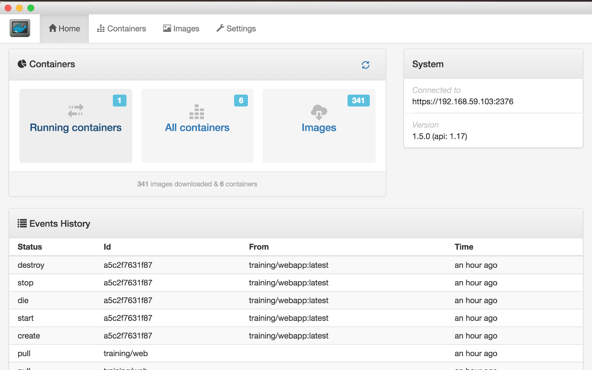
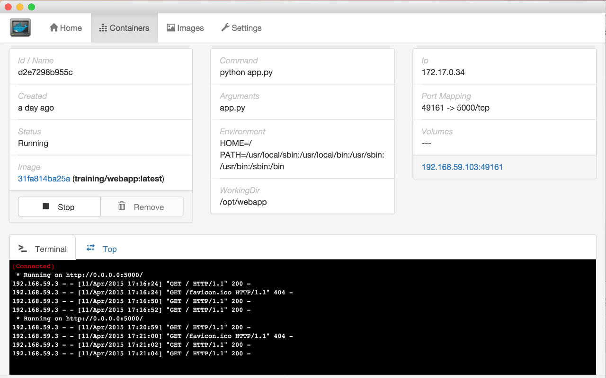

## Docker UI
 
Simple Docker UI is an unofficial developer tool for monitoring and managing your Docker containers.
Available for OS X, Windows, ChromeOS and Linux

* [Download Windows version](https://github.com/felixgborrego/docker-ui-chrome-app/releases) 
* [Download OS X version](https://github.com/felixgborrego/docker-ui-chrome-app/releases) 
* [Download Linux version](https://github.com/felixgborrego/docker-ui-chrome-app/releases) 

Deprecated version:

* [Download Chrome plugin version](https://chrome.google.com/webstore/detail/jfaelnolkgonnjdlkfokjadedkacbnib)

This app uses Docker Remote Api.
Please note this is a beta version and only provides a basic set of features.
I'm actively working to add new features and bug fixing.
Any feedback is more than welcome!

[Video Example](https://youtu.be/x6RVTHp5M7w)

### Main features

* Native app for Windows, MacOS and Linux.
* Garbage collection for unused containers. Removing containers that haven't been in use for the last few days.
* Garbage collection for unused images, Keeping only the ones used by a container.
* Virtual terminal to log into the container.
* Search & pull images from the Docker Hub
* Start/stop/delete containers
* List of running containers and containers history.
* See Docker events.
* Easy GUI to manage Docker

### Config

[Connect on OS X](https://github.com/felixgborrego/docker-ui-chrome-app/wiki/OS-X-Installable-Desktop-version)

[Connect on Windows](https://github.com/felixgborrego/docker-ui-chrome-app/wiki/Windows-installable-Desktop-version)

[Connect on Linux](https://github.com/felixgborrego/docker-ui-chrome-app/wiki/linux)

### Stack

*  [Scala.js](http://www.scala-js.org/)
*  [React on Scala.js](https://github.com/japgolly/scalajs-react)
*  [Electron](http://electron.atom.io)
*  Bootstrap
*  Bower
*  Momentjs

### Contributing

Compile and test it yourself:

* [Electron app](electron/README.md)
* [Chrome app](chromeapp/README.md)

Contributions are more than welcome. Bug reports with specific reproduction steps are great. If you have a code contribution you'd like to make, open a pull request with suggested code.

### Copyright and License

All code is available to you under the MIT license, available at
http://opensource.org/licenses/mit-license and also in the [COPYING](COPYING) file.

Copyright the maintainers, 2015-2016.
  
